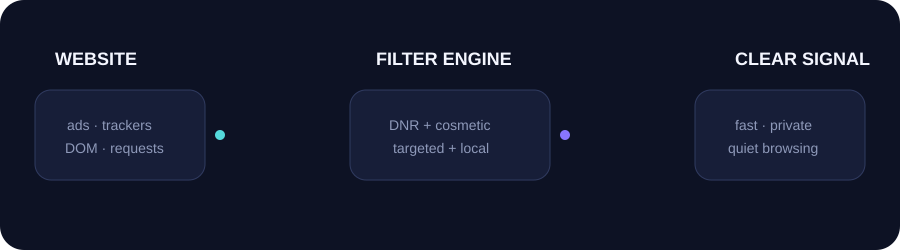

#  Super Adblock


> **Quiet web. Clear signal.**

Super Adblock is a standards-based Manifest V3/WebExtensions blocker for ads,
trackers, and annoying overlays. It combines official Declarative Net Request
(DNR) rules with a lightweight, targeted cosmetic engine. It is maintained by
[dikaofc](https://github.com/dikaofc).

The current repository release is **v1.1.5**. The Firefox Add-ons listing
currently serves **1.0.1**; upload the `v1.1.5` Firefox package to AMO to
publish the latest fixes.

No stealth, DRM changes, session theft, premium spoofing, anti-adblock bypass,
or remote JavaScript execution is included.

<p align="center">
  
</p>

## Features

| Surface | Included |
| --- | --- |
| Network layer | Ads, trackers, annoyances, custom rules |
| Cosmetic layer | Generic selectors, targeted dynamic cleanup |
| YouTube | Dedicated selectors, SPA navigation hooks |
| Controls | Global toggle, per-site toggle, local whitelist storage |
| Observability | Local blocked-request counter |
| Performance | Debounced observer; only changed DOM nodes are processed |
| Safety | Malformed custom rules are ignored instead of crashing the engine |

## Browser support and installation

- Firefox Desktop and Firefox for Android (WebExtensions, Firefox 142+)
- Chrome, Edge, Brave, and Opera (Chromium MV3)

Chromium browsers use the Chrome MV3 manifest because their extension APIs are
compatible.

### Firefox

Install the reviewed version from the
[Firefox Add-ons listing](https://addons.mozilla.org/en-US/firefox/addon/super-adblock/).
The manifest declares Firefox for Android support (`gecko_android`) for
Firefox 142 and newer. On Android, install it from the AMO listing in Firefox
for Android; local `about:debugging` development is desktop-only.
For local development, load `dist/firefox` from `about:debugging` or run:

```powershell
npx --yes web-ext run --source-dir .\dist\firefox
```

### Chromium browsers

Open the browser's extension manager, enable **Developer mode**, choose
**Load unpacked**, and select the matching directory under `dist/`.

## Current release

[Super Adblock v1.1.5](https://github.com/dikaofc/super-ads-blocker/releases/tag/v1.1.5)
contains POSIX-path ZIP archives suitable for browser-store upload:

- `super-adblock-firefox-v1.1.5.zip`
- `super-adblock-chrome-v1.1.5.zip`
- `super-adblock-edge-v1.1.5.zip`
- `super-adblock-brave-v1.1.5.zip`
- `super-adblock-opera-v1.1.5.zip`

The Firefox package has been checked with `web-ext lint`. AMO signing and
publication are handled by Mozilla; the GitHub ZIP is not itself a Mozilla
signed package.

## Build locally

Requires Node.js 18 or newer. No runtime package dependencies are required.

```powershell
npm run build
```

Targeted builds:

```powershell
npm run build:firefox
npm run build:chrome
npm run build:chromium
```

Output:

```text
dist/
├── firefox/
├── chrome/
├── edge/
├── brave/
└── opera/
```

The build copies source files into browser-specific unpacked directories. To
create a store-compatible archive on Windows, use forward-slash entry paths:

```powershell
@'
from pathlib import Path
from zipfile import ZipFile, ZIP_DEFLATED
root = Path("dist/firefox")
with ZipFile("release/super-adblock-firefox.zip", "w", ZIP_DEFLATED) as archive:
    for file in root.rglob("*"):
        if file.is_file():
            archive.write(file, file.relative_to(root).as_posix())
'@ | python -
```

## Architecture

```text
request ──▶ Declarative Net Request ──▶ block / allow
   │
DOM ──────▶ targeted cosmetic engine ──▶ remove / observe
                              ├── generic rules
                              └── YouTube adapter
```

The content engine never rescans the entire page for every mutation. It
debounces mutation batches, processes only added element nodes, and uses
targeted selectors. Site delivery changes over time, so the YouTube adapter and
rule packs are deliberately easy to update.

## Project layout

```text
src/
├── background/   DNR lifecycle, messaging, custom rules, stats
├── content/      cosmetic filtering and targeted mutation observer
├── sites/        site adapters, including YouTube SPA hooks
└── shared/       browser API, storage, and utilities
rules/            network and cosmetic rule packs
popup/            custom dark-glass popup UI
options/          custom control-room UI for custom rules
assets/           SVG artwork and PNG browser/listing icons
```

## Design principles

- Use official extension APIs and least-privilege behavior.
- Keep blocking aggressive while keeping DOM work bounded.
- Keep settings and counters local by default.
- Do not collect personal data or execute remote code.
- Surface failures instead of silently converting them into success.
- Make filter updates maintainable as website markup changes.

## Permissions and privacy

The extension requests access to browser tabs, all website content, storage, and
Declarative Net Request so it can block requests and clean page elements. The
extension stores settings and blocked counts locally and does not require data
collection. Review the source and bundled rules before installing.

## License

The Firefox listing currently uses **All Rights Reserved**. No separate open
source license has been granted for this repository.
